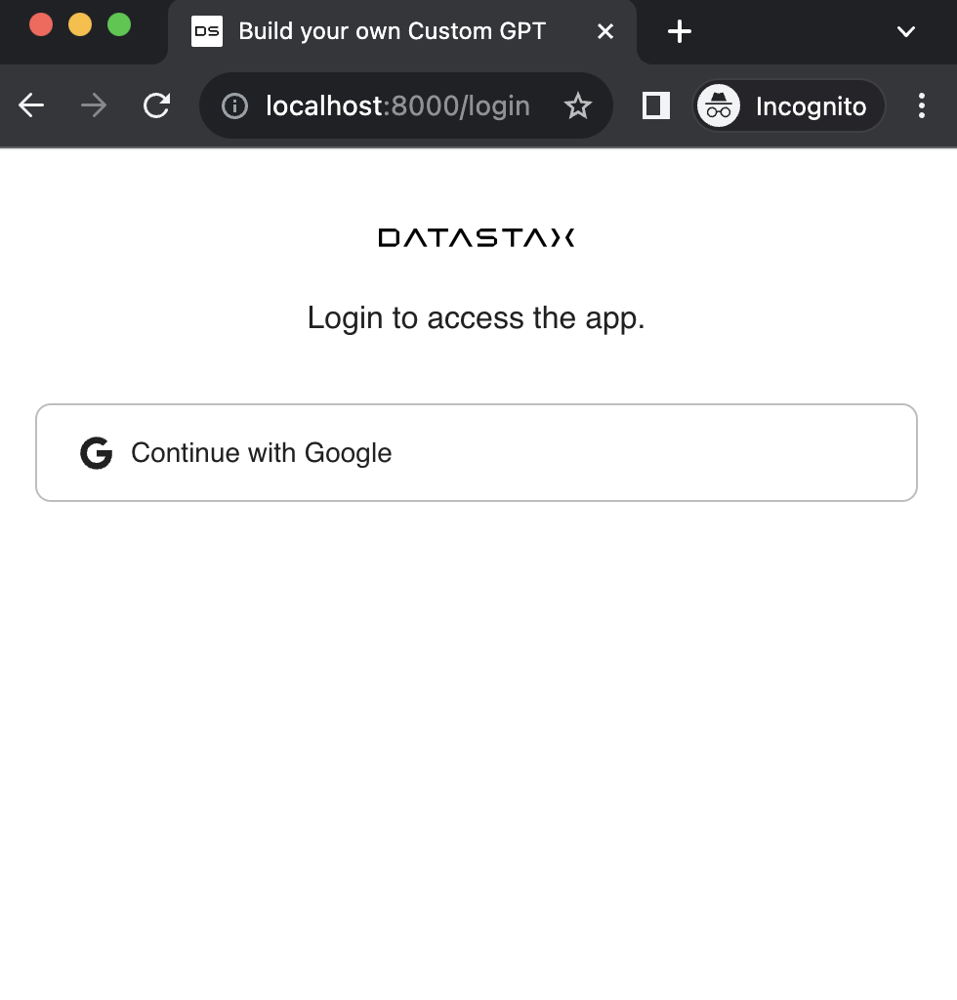
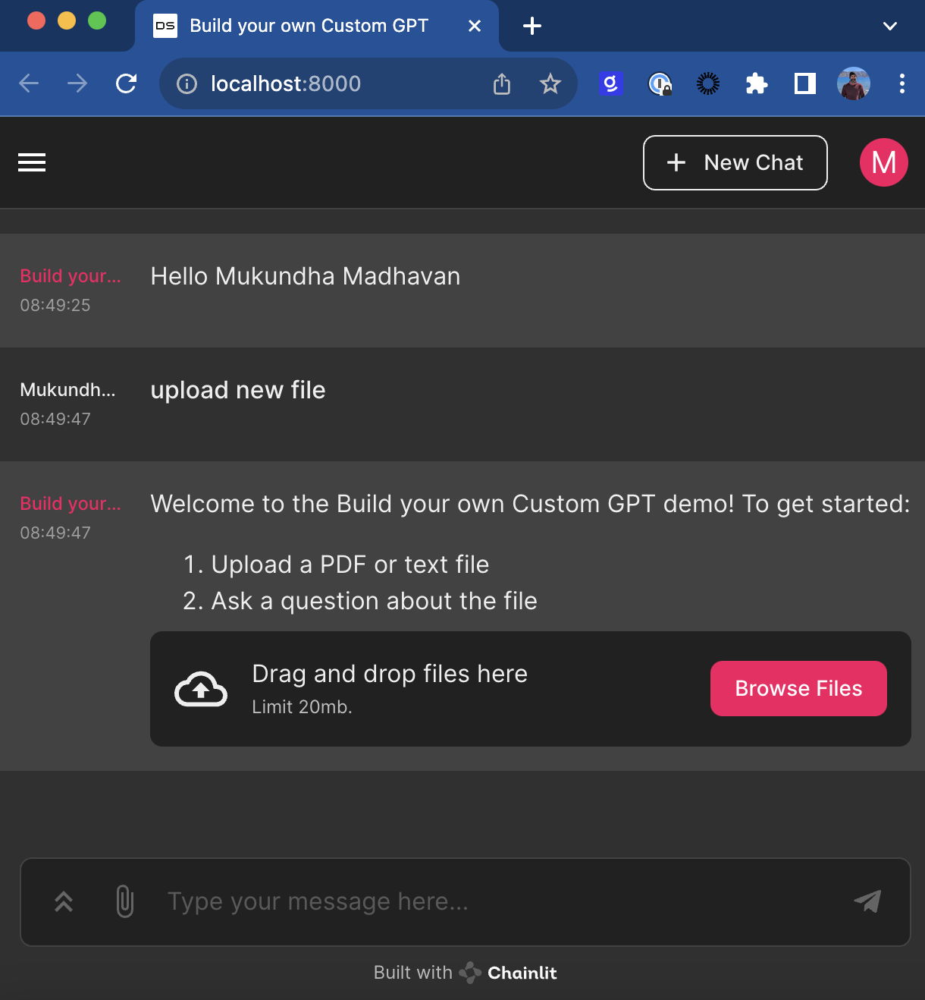
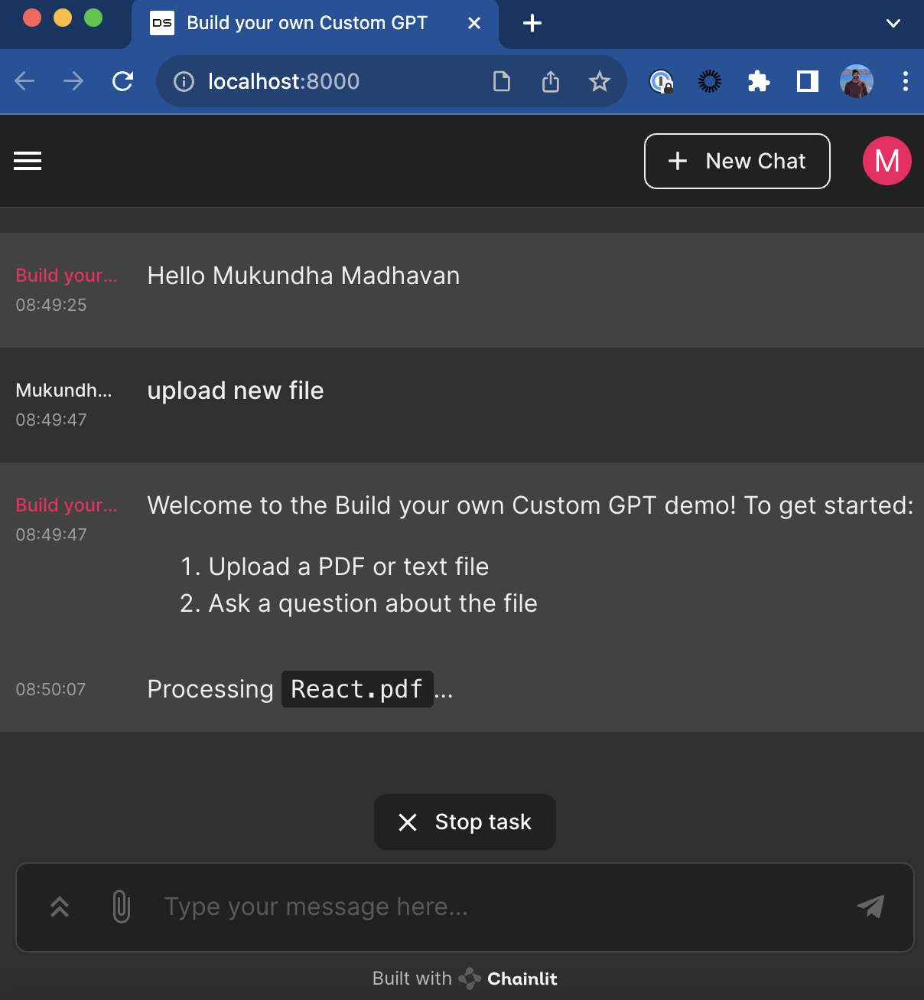
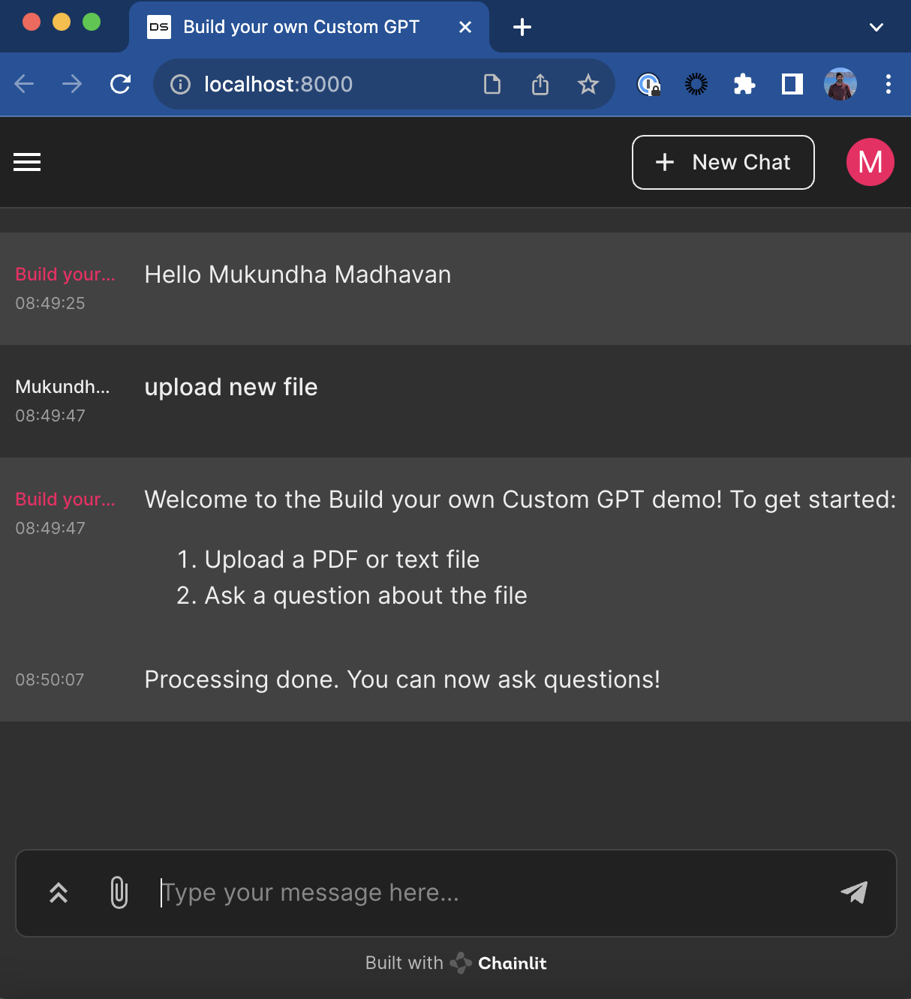
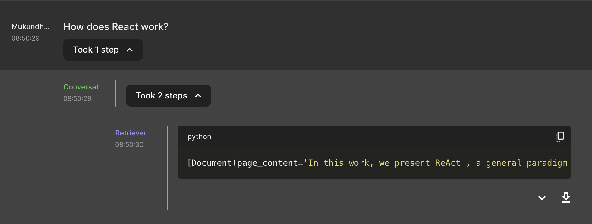
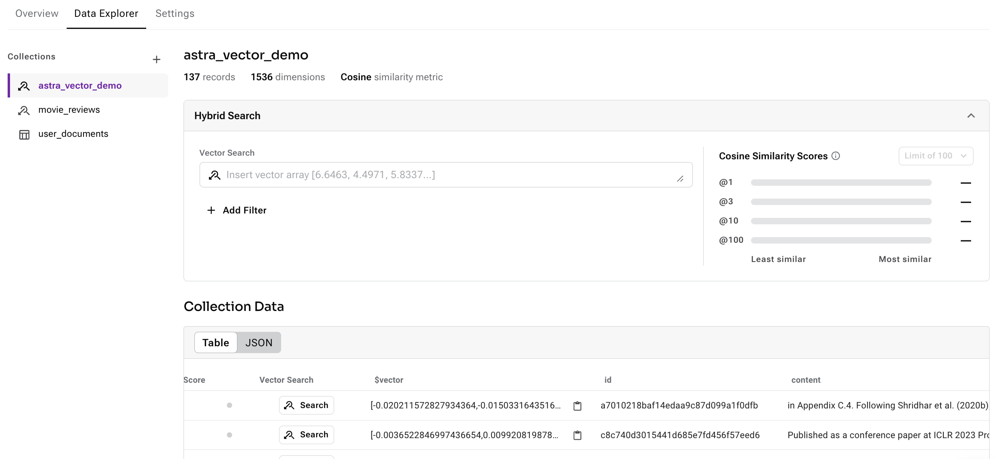

### Build your own Custom GPT with RAGStack

[RAGStack](https://www.datastax.com/products/ragstack)
- AstraDB
- Langchain
- OpenAI 

### Inspiration

- [Build your own Custom ChatGPTs](https://openai.com/blog/introducing-gpts)
OpenAI allows anyone to create a custom GPT, with their own data. Very cool solution, but proprietary, data is stored and managed by OpenAI. 
- [Astra Assistants API](https://www.datastax.com/blog/introducing-the-astra-assistants-api)
Datastax introduced an implementation of OpenAI's assistant API, that allows developers to easily build custom GPTs. Your data is in your control, stored and managed in your Astra DB account.

### This:
Let developers (businesses) create their own "Build your own custom GPT" solution for their users. 
. 
Solution is Similar to both of the above, but
- you can run a similar service for your users
- demonstrates how you can build such a solution using Astra DB and Langchain (which also means, you have optionality to choose any LLM - for eg, Palm2 or Claude or llama etc..)

### Get started

- [Signup for Astra DB](https://astra.datastax.com/)
- [Recommended] [Enable Preview](https://www.datastax.com/blog/astra-db-serverless-vector-new-experience) for Vector and JSON native experience
- [Refer Google Signin guide](https://developers.google.com/identity/sign-in/web/sign-in#create_authorization_credentials) for Google OAuth credentials, this is used for login to the app.

Required environment variables
```
OPENAI_API_KEY=xx
ASTRA_DB_API_ENDPOINT=xxx
ASTRA_DB_APPLICATION_TOKEN=xxx
OAUTH_GOOGLE_CLIENT_ID=xxx
OAUTH_GOOGLE_CLIENT_SECRET=xxx
CHAINLIT_AUTH_SECRET=1234567890
```

Run

```
chainlit run app.py
```

### How it works

UI - chainlit

<p float="left">










</p>
#### Google Login
App is protected with Google Login, after Login `username` returned by Google is used as key to manage user session and data.

#### Loading data for user
After login, user can instruct `upload new file` to upload new files.
- file is split into chunks
- username added to metadata
- stored in AstraDB as a JSON collection

```
text_splitter = RecursiveCharacterTextSplitter(chunk_size=1000, chunk_overlap=100)
loader = PyPDFLoader(filename)
docs = loader.load_and_split(text_splitter=text_splitter)        

for doc in docs:
    doc.metadata["source"] = f"{file.name}"
    doc.metadata["username"] = f"{app_user.username}"

vstore = AstraDB(
        embedding=embeddings,
        collection_name="astra_vector_demo",
        api_endpoint=ASTRA_DB_API_ENDPOINT,
        token=ASTRA_DB_APPLICATION_TOKEN,
    )
vstore.add_documents(docs)
```
That's it! 



#### Chat with your Data

Uses `langchain` to create a conversational chain,
Note: Metadata filtering is used to search only in the documents this user has uploaded.

```
chain = ConversationalRetrievalChain.from_llm(
        ChatOpenAI(model_name="gpt-4-1106-preview", temperature=0, streaming=True),
        chain_type="stuff",        
        retriever=vstore.as_retriever(
            search_kwargs=
                {"filter": {"username": f"{app_user.username}"},"k": 5}),
        memory=memory,
        return_source_documents=True,
    )
```
